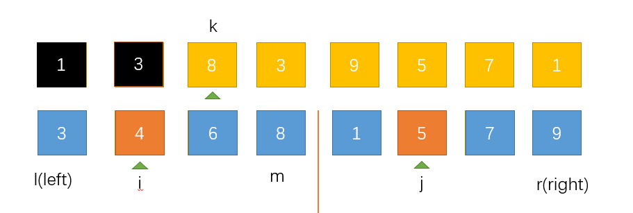

# 归并排序

跟快速排序一样，归并排序也是一种高级排序算法，时间复杂度为O(nlogn)，这里介绍两种归并排序的思路和实现方式。    

## (一).二分递归方式实现归并排序        

### 划分     

这里采用二分的方式将含有n个数据的原数组层层向下划分，当划分到n/2个组的时候停止，这时每个组只有1个数据，我们将这n/2个组看作是有序的，下面是划分过程：   

    

这里到第三次划分后，每个组就只有一个元素了。这里可以思考一下，这个3是怎么得来的，我们采用了二分的方式，每次进行这样除以2的划分，划分次数很明显是`log2N`次，所以这样就有一个O(logN)的一个时间复杂度，而且如果这里数组长度n不是2的整数倍的话，这里也会取整为log2N。       

### 归并       

划分完成后，就来进行归并操作了，先看一下图解：     

第一次向上归并：    

     

这次归并完成后，每组就有了两个数据，并且每个都是有序组，接着以同样的方式进行第二次归并     


第二次向上归并：    

     

这样每组就有了四个元素，而且每组都是有序组，接着我们进行最后一次归并    

第三次向上归并：    

     

最后一次归并后，我们之前划分出来的组都已经消失了，只剩下了一个组，而且是个有序组，我这样描述是不是有一种递归的感觉呢。     

这就是二分归并排序的基本思想。     

上面说到划分过程已经有了一个logN的时间复杂度，这里再思考一下，其实我们对每一层进行归并的时候，我们对每一个元素都进行了访问和比较，我们的数组就有N个元素，所以这里也有O(N)个时间复杂度，再乘上上面划分的层次，所以算法的整体时间复杂度就是O(NlogN)。       


### 归并过程的实现(核心)         

如果上面的你都看懂了，那么我们下面来考虑一个看上去很简单，但实际上并不简单的问题，我们先回到最后一次归并之前的情形：     

   

我现在问你，你如何把这两个有序组归并成一个仍然有序的组？    

其实我们每次归并的时候都有这样的一个操作，只是操作的次数不同而已。    

下面来谈一下如何实现这个核心的归并过程：       

我想了一圈发现根本不能通过在原数组上通过交换位置来实现这个过程。     

这里我们需要开辟一个临时空间来辅助我们完成这个过程，有了这个临时空间，我们这个操作就变得很容易了，这也是所有的归并排序方式必须使用的一个方法，也是归并排序的一个缺点，虽然它有着较小的时间复杂度，但是它需要另外的空间才能实现。       


来看一下图解：     

     

这里我们设置了三个索引，上面的一个索引用来指向结果数组，下面的两个索引分别指向两个有序组，因为我们是要对整体进行归并。我们将原数组作为结果数组，将开辟出来的临时数组作为处理数组，下面开始第一次归并操作：    

比较处理数组中的两个索引指向的索引，谁此时指向的值较小，就先把这个较小的值放置到结果数组中，这时，结果数组的索引就可以向后推进一位，准备下一次接受结果，同样，刚才指向较小值的那个索引也可以向后推进一位，准备下一次比较。     

过程就是这样，下面我多来模拟几次加深记忆：    

    

这次操作中，先比较3和1，发现1比较小，所以就把1放到结果数组中，然后结果数组和1所在数组的索引都向后推进了一位。    

    

这次操作中，先比较3和5，发现3比较小，所以就把3放到结果数组中，然后结果数组和3所在数组的索引都向后推进了一位。       

这样一直进行下去我们就把多个有序组归并成了一个有序组。     


* 这里我们考虑一个特殊情况：    
  如果我们在比较的时候出现了其中一个组已经全部处理完成的情况，也就是这个组的前几个数都比较小，而且都已经被放到结果数组中了，这时只剩下了另一个组中的几个数据没有被处理，这就更好解决了，我们必须始终明确的一点就是我们是对多个有序组进行操作的，所以我们直接将剩下的数据按照原来的顺序放到结果数组就ok了。        

* 下面我们来定义一下归并操作需要用到的一些变量，并把他们的实际位置在图上标出来     

   

我们来一一介绍：    

* i是左边有序数组的索引，注意这里它指向的是当前要比较的数据    
* j是右边有序数组的索引，注意这里它也指向的是当前要比较的数据   
* k是结果数组的索引，注意这里它指向的下一个要放入的位置，和i，j不一样    
* l指向数组的开始      
* r数组的结尾，这样数组就成了[l,r]这样一个前闭后闭区间    
* m指向中间位置，这里我们选取中间位置为左边有序数组的最后一个数据      

定义好了这些索引变量，我们就应该能将这个算法实现了。    

### 代码实现     

```c++
#include <iostream>


using namespace std;


/*归并操作具体实现，将arr[l..mid]和arr[mid+1..r]两部分归并成一个有序组*/
void merge(int arr[], int l, int mid, int r)
{
	int i, j, k;//定义三个操作索引
	//先将要处理的数组保存一份
	//开辟动态数组
	int *temp = new int[r - l + 1];
	for (i = l; i <= r; i++)
		temp[i - l] = arr[i];//因为temp数组是从0开始的，和arr的索引有l个偏移量

	i = l;//i为左边数组的开始
	j = mid + 1;//j为右边索引的开始
	for (k = l; k <= r; k++)
	{
		//先处理特殊情况即其中一个组先遍历完成，然后就将另一个有剩余元素的组按照顺序放到结果数组中
		if (i > mid)
		{
			arr[k] = temp[j - l];
			j++;
		}
		else if (j > r) {
			arr[k] = temp[i - l];
			i++;
		}
		//这里就比较当期i，j两个索引指向的元素的大小，较小的一个就放到arr中，同时该组的索引向后推进，arr的索引向后推进
		else if (temp[i - l] < temp[j - l])
		{
			arr[k] = temp[i - l];
			i++;
		}
		else
		{
			arr[k] = temp[j - l];
			j++;
		}
	}


	//释放上面开辟数组的空间
	delete []temp;
}


/*递归函数实现arr[l..r]的归并排序*/
void __resursiveMergeSort(int arr[], int l, int r)
{
	//当处理数组为空时结束递归
	if (l >= r)
		return;

	//设置二分索引
	int mid = (l + r) / 2;
	__resursiveMergeSort(arr, 0, mid);
	__resursiveMergeSort(arr, mid + 1, r);
	//归并操作(核心)
	merge(arr, l, mid, r);
}


/*二分递归公有有方法归并排序*/
void recursiveMergeSort(int arr[], int n)
{
	__resursiveMergeSort(arr, 0, n - 1);
}


int main()
{
	int arr[6] = { 3,4,2,1,5,0 };
	recursiveMergeSort(arr, 6);
	for each (int i in arr)
	{
		cout << i << " ";
	}
	cout << endl;
	system("pause");
	return 0;
}
```   


## (二).
